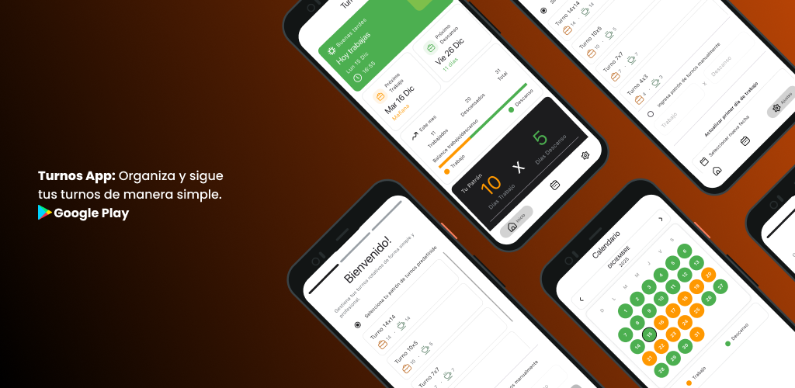
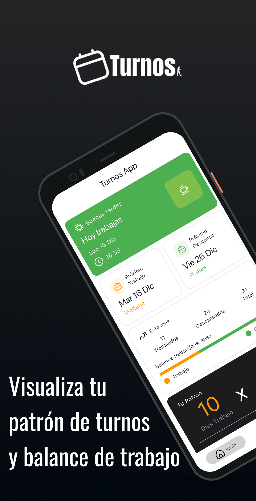
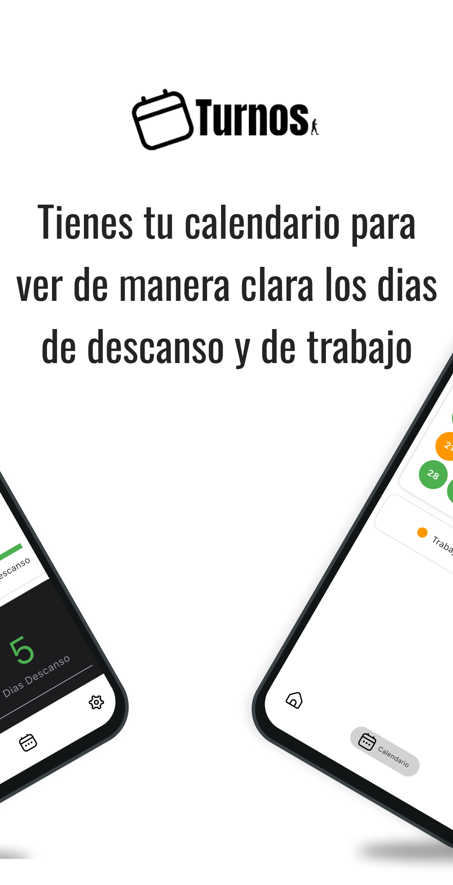
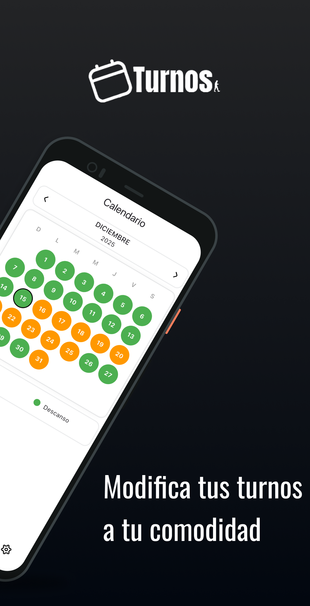
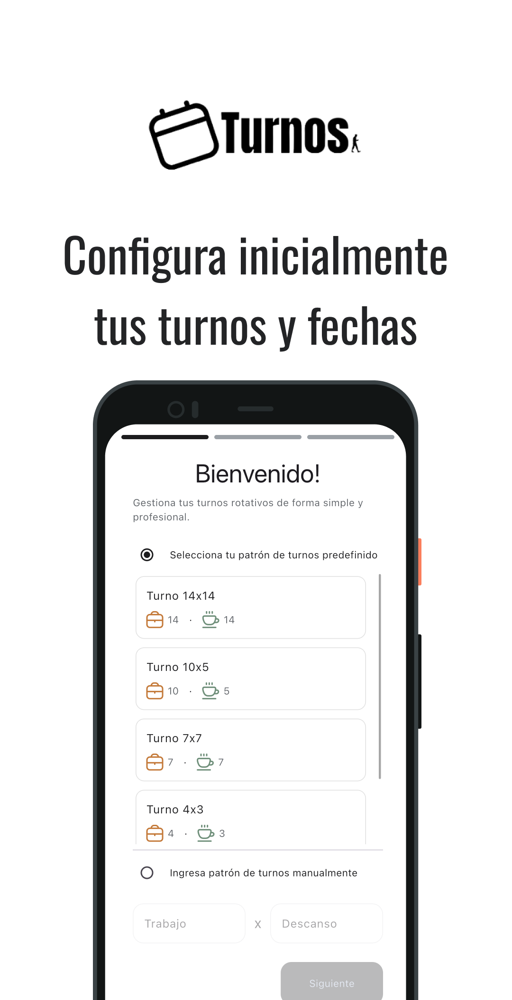

    

  

# Turnos App

Aplicación móvil desarrollada en **Flutter** para llevar el control de **turnos rotativos de trabajo** de manera simple, clara y visual.

Está enfocada en personas que trabajan bajo esquemas como **10x5**, **14x14**, **7x7**, u otros patrones donde se trabajan *Y* días y se descansan *Z* días.

---

## 📱 Características principales

- Configuración inicial mediante **Onboarding**
- Soporte para patrones de turnos personalizados (YxZ)
- Cálculo automático de días de trabajo y descanso
- Información clara del estado actual del día
- Visualización mediante calendario con colores
- Persistencia de datos en **almacenamiento local**
- Gestión de estado centralizada mediante **Cubit**
- Soporte para múltiples idiomas mediante **l10n**

---

## 🚀 Onboarding (configuración inicial)

El onboarding se ejecuta **una sola vez** y permite configurar el patrón de turnos del usuario.

### Paso 1: Registro del patrón de turnos
El usuario define:
- Días de trabajo (Y)
- Días de descanso (Z)

Ejemplos de patrones:
- 10x5
- 14x14
- 7x7

---

### Paso 2: Ingreso de la primera fecha de trabajo
Se selecciona la **fecha inicial** desde la cual comienza el ciclo de turnos.

---

### Paso 3: Verificación de la información
Pantalla de confirmación donde el usuario valida:
- Patrón seleccionado
- Fecha inicial de trabajo

Una vez confirmado:
- El onboarding no vuelve a mostrarse
- La información se guarda en el **almacenamiento local del dispositivo**

---

## 🏠 Vistas principales

### 📊 Dashboard
Muestra información clave del turno actual:
- Patrón de turnos activo
- Estado del día (Trabajo / Descanso)
- Próximo día de trabajo
- Próximo día de descanso
- Balance general del ciclo

---

### 📅 Calendario
Vista mensual que muestra:
- Días de trabajo y descanso diferenciados por colores
- Representación visual del patrón aplicado al calendario

---

### ⚙️ Settings
Permite modificar la configuración inicial:
- Cambiar el patrón de turnos
- Cambiar la primera fecha de trabajo

Al realizar cambios:
- Se recalculan automáticamente los ciclos
- Se actualiza la información almacenada

---

## 🧠 Gestión de estado

La aplicación utiliza **Cubit** como patrón de gestión de estado.

- Toda la lógica de negocio se gestiona mediante Cubits
- Los estados controlan el flujo del onboarding y las vistas principales
- Se mantiene una separación clara entre lógica de presentación y lógica de aplicación
- No se utiliza `setState` para la lógica principal de la app

---
## 🌍 Internacionalización (l10n)

La aplicación implementa **localización (l10n)** para soportar múltiples idiomas.

- Textos centralizados mediante archivos de localización
- Cambio de idioma según la configuración del dispositivo
- Arquitectura preparada para escalar a nuevos idiomas

---

## 💾 Persistencia de datos

- El patrón de turnos y la fecha inicial se almacenan localmente
- La información se mantiene entre reinicios de la aplicación
- No requiere conexión a internet
- No depende de servicios externos ni backend

---

## 🛠️ Tecnologías

- Flutter
- Dart
- Cubit (Flutter Bloc)
- l10n (Flutter localization)
- Almacenamiento local

---

## 🎯 Objetivo del proyecto

Este proyecto tiene como objetivo:
- Practicar desarrollo de aplicaciones móviles con Flutter
- Implementar gestión de estado usando Cubit
- Modelar lógica de fechas y ciclos de trabajo
- Manejar persistencia local
- Construir una aplicación simple pero funcional para un escenario real

---

## 📌 Notas

- Aplicación pensada para uso personal
- Proyecto sin backend
- Enfocado en simplicidad y claridad de uso

## 📸 Screenshots

  

  
  
  
  

